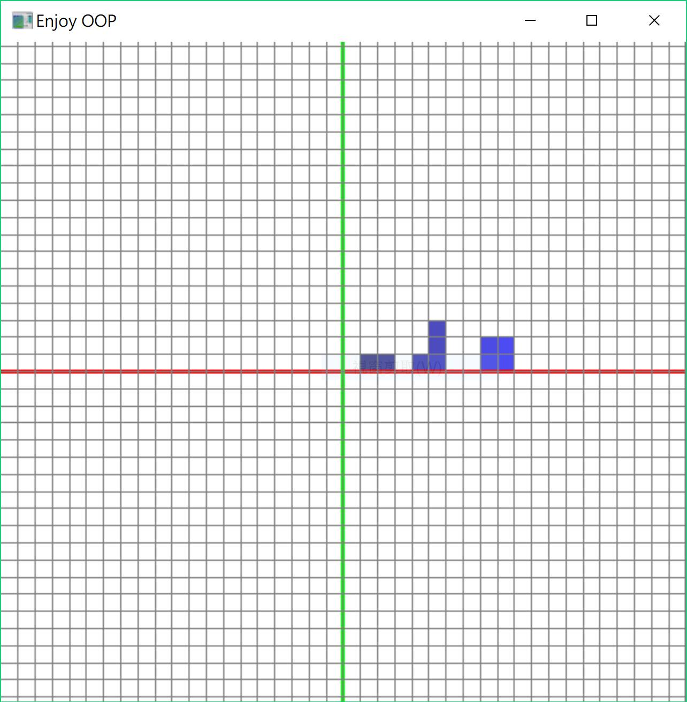

# nctu-oop-assignments
Programming assignments for NCTU Object Orientation Programming Class.

**Course No:** 1186  
**Semester:** 1042  
**Teacher:** 黃世強  

## General Key Usage
* **F1~FX**: perform different tasks  
* **1~x**: Adjust parameter in current task  
* **i, I**: ask for input
* **s, S**: show the student information 

## Screenshots
### Assignment1:
* **F1**: Monte Carlo Simulation  
    
* **F2**: Quadratic Function Calculation  
    
* **F3**: Cubic Function Calculation  
    
* **F4**: Student record management  
    
  
### Assignment2:
* **F1**: Monte Carlo Simulation  
    
* **F2**: Galaxy Simulation  
    
* **F3**: Painter  
    
* **F4**: Read a bitmap from a file  
    
* **F5**: Visualization of bubble sort  
    
  
### Assignment3:
* **F1**: Dots drawer  
    
* **F2**: 2048 game  
    

## Credits
**Templates were given by the teacher and the TAs, student's work is in 00_StudentWork folder.**
